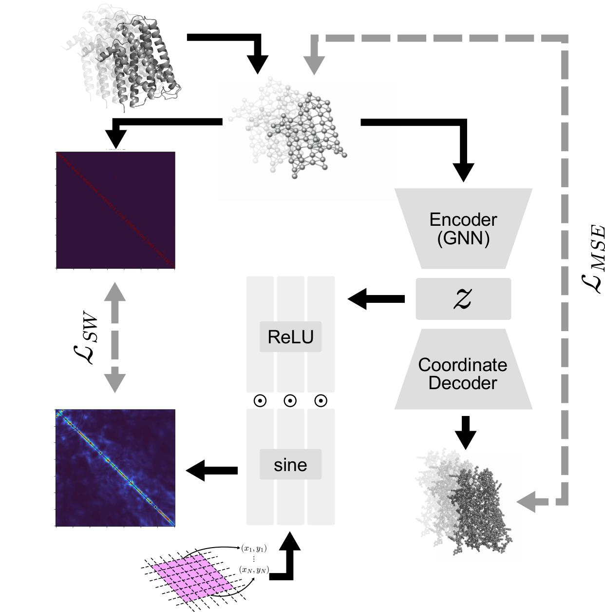

# molIGNR_prot — Conformational Generative Modeling of Full-Atom Protein Structures

Graph-based generative model for full-atom protein conformations. Encodes MD trajectory frames as graphs, learns a latent space via a GNN encoder, and decodes new conformations using a coordinate MLP and a SIREN-based graphon decoder trained with a Gromov-Wasserstein loss.


## Model


**molIGNR** (Molecular Implicit Graphon Neural Representation):

- **Encoder**: GIN or ChebNet GNN → global mean pool → latent code `z` (dim 16)
- **Graphon decoder**: SIREN network conditioned on `z` via a Modulator, trained with sliced Wasserstein distance against the input adjacency matrix
- **Coordinate decoder**: MLP mapping `z` → full-atom 3D coordinates `(N, 3)`

Loss = coordinate MSE + Gromov-Wasserstein graphon loss (GW loss added after epoch 1).

## Installation

```bash
conda env create -f environment.yml
conda activate env
```

## Data

| Protein | Class | PDB | Atoms | Source |
|---------|-------|-----|-------|--------|
| Dopamine D2 Receptor (D2R) | A | 6CM4 | 2191 | [Zenodo 10.5281/zenodo.15479781](https://zenodo.org/records/15479781) |
| Rhodopsin | A | 6AKY | 4539 | [GPCRmd](https://www.gpcrmd.org/) |
| Secretin | B | 4K5Y | 4250 | [GPCRmd](https://www.gpcrmd.org/) |

Pre-processed graph datasets (`.pt` files) should be placed in `data/`. Reference PDB files (`heavy_chain.pdb`, `dyn_1119_heavy.pdb`, `dyn_95_heavy.pdb`) are also expected in `data/`.

## Repository Structure

```
molIGNR_prot/
├── train_IGNR.py          # Training script
├── data_.py               # Dataset loading
├── utils.py               # Argument parser, PDB writing, latent space visualization
├── load_checkpoints.py    # Checkpoint loading and evaluation
├── linear_interpolation.py # Latent space linear interpolation
├── environment.yml        # Conda environment
└── models/
    ├── model.py           # cIGNR model (encoder + graphon decoder + coordinate decoder)
    ├── layers.py          # GIN convolution layer
    └── siren_pytorch.py   # SIREN network and Modulator
```

## Training

```bash
python train_IGNR.py --dataset dyn_1119_heavy --save_output
```

Key arguments (set directly in `__main__`):

| Argument | Default | Description |
|----------|---------|-------------|
| `dataset` | — | Dataset name (e.g. `dyn_1119_heavy`, `dyn_95_heavy`, `full_knn4_10`) |
| `latent_dim` | 16 | Latent space dimension |
| `gnn_type` | `gin` | GNN encoder type (`gin` or `chebnet`) |
| `n_epoch` | 200 | Number of training epochs |
| `batch_size` | 12 | Batch size |
| `lr` | 0.01 | Learning rate |

Checkpoints are saved every 5 epochs to `Results/checkpoints/`.

## Evaluation

Load a checkpoint and run evaluation:

```python
from load_checkpoints import load_model, test_d2r, test_gpcrmd_

model, prog_args, epoch, _ = load_model("Results/checkpoints_final/<checkpoint>.pt")

# D2R
test_d2r(prog_args, train_loader, model, pdb_path="data/heavy_chain.pdb")

# GPCRmd (Rhodopsin / Secretin)
test_gpcrmd_(prog_args, train_loader, model, pdb_path="data/dyn_1119_heavy.pdb")
```

Reported metrics per sample: MSE, backbone MSE, sidechain MSE, lDDT, backbone lDDT, TM-score.

## Latent Space Interpolation

Linear interpolation between consecutive latent codes to generate intermediate conformations:

```python
from linear_interpolation import run_linear_interpolation
from load_checkpoints import load_model

model, prog_args, _, _ = load_model("<checkpoint>.pt")
run_linear_interpolation(model, prog_args,
                         full_data_path="data/full_data.pt",
                         data_path="data/data_interval10.pt",
                         interval=10, N=2191)
```
